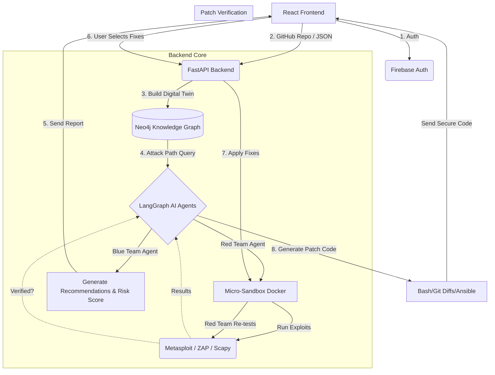

# SentinelAI - Codeflow & Architecture

## 🛠️ Relevant Tech Stack
| Component | Technology |
| :--- | :--- |
| **Frontend** | React (TSX) + Tailwind CSS (Vercel par deployable) |
| **Backend** | FastAPI (Python) |
| **Database & Graph** | Firebase Firestore (NoSQL) + Neo4j (Knowledge Graph) |
| **AI Agents Engine** | LangGraph + Gemini / GPT Models |
| **Authentication** | Firebase Auth |
| **Sandbox Environment** | Ephemeral Docker Containers (Lightweight Alpine Linux) |
| **Offensive (Red Team) Tools** | Metasploit, Scapy, Exploit-DB, OWASP ZAP (Headless) |
| **Threat Intelligence** | CVE + MITRE ATT&CK mapping JSONs |

---

## 🔄 Codeflow & Architecture (Step-by-Step)

Here is the flow of how data moves across the system and which technology handles it:

### 1. Authentication & Input (Frontend)
* **Flow:** User Landing page par aata hai, Firebase Auth se Login karta hai. Phir dashboard mein "Connect GitHub Repository" ya ZIP upload se apna codebase ya infrastructure data (JSON) bhejta hai.
* **Tech:** `React`, `Tailwind CSS`, `Firebase Auth`

### 2. Repository Processing & Digital Twin Generation (Backend)
* **Flow:** Backend request receive karta hai, ek secure temporary workspace (Docker mein) banata hai aur code/JSON ko analyze karke ek **Digital Twin** (Virtual representation of OS, apps, versions) banata hai.
* **Tech:** `FastAPI` (Handling API requests), `Docker` (Workspace)

### 3. Knowledge Graph Construction & Attack Path Analysis
* **Flow:** Digital Twin ke data ko graph format me map kiya jata hai (Assets ➔ Software ➔ CVEs ➔ MITRE Techniques). Graph algorithms use karke vulnerable attack paths (jaise Internet ➔ Apache ➔ DB) nikale jaate hain, bina poore network ko simulate kiye.
* **Tech:** `Neo4j`, `Cypher Query Language`, `NetworkX` (Python)

### 4. Targeted Micro-Sandbox Execution (Red Team AI)
* **Flow:** Backend ek lightweight sandbox Docker container spin-up karta hai jisme sirf vulnerable assets hote hain. **Red Team AI Agent** active attacks karta hai (e.g. Metasploit payloads, Burp intercepts).
* **Tech:** `Docker Engine API`, `LangGraph` (Agent orchestration), `Metasploit/Scapy/ZAP`

### 5. AI Recommendations (Blue Team AI)
* **Flow:** Graph data aur Sandbox attack results **Defense Agent** (Blue Team AI) ko bheje jaate hain. Agent decide karta hai ki sabse critical risk kya hai aur usko fix (patch) karne ki recommendations deta hai. Report aur Risk Score UI par dikhta hai.
* **Tech:** `LangGraph`, `Gemini/GPT` (LLMs), `FastAPI` ➔ `React`

### 6. Interactive Remediation (User Action)
* **Flow:** User dashboard pe AI ki recommendations dekhta hai aur select karta hai ki usko konsi recommendations abhi fix karni hain (e.g., Selects "Patch Apache" & "Enable MFA").
* **Tech:** `React` (State management & API calls back to FastAPI)

### 7. Patch Verification (Remediation Agent)
* **Flow:** **Remediation Agent** user ke select kiye hue fixes ko wapas Micro-Sandbox mein apply karta hai. Red Team wapas attack karti hai check karne ke liye ki kya vulnerability sach me fix hui. Agar attack fail hota hai, toh patch verify ho jata hai aur Sandbox destroy ho jata hai.
* **Tech:** `LangGraph`, `Docker` (Sandbox rebuild and destroy)

### 8. Code Generation & Output
* **Flow:** Verified patches ke basis par AI actual Bash scripts, Ansible playbooks ya Git Diffs generate karta hai. Naya Risk score calculate hota hai (e.g. Risk drop from 87 to 41). User ye secure patch download kar sakta hai.
* **Tech:** `LLM Code Generation`, `FastAPI` (Delivering output file to frontend), `React` (Download action).

---

## 📊 Visual Representation (Mermaid Diagram)

